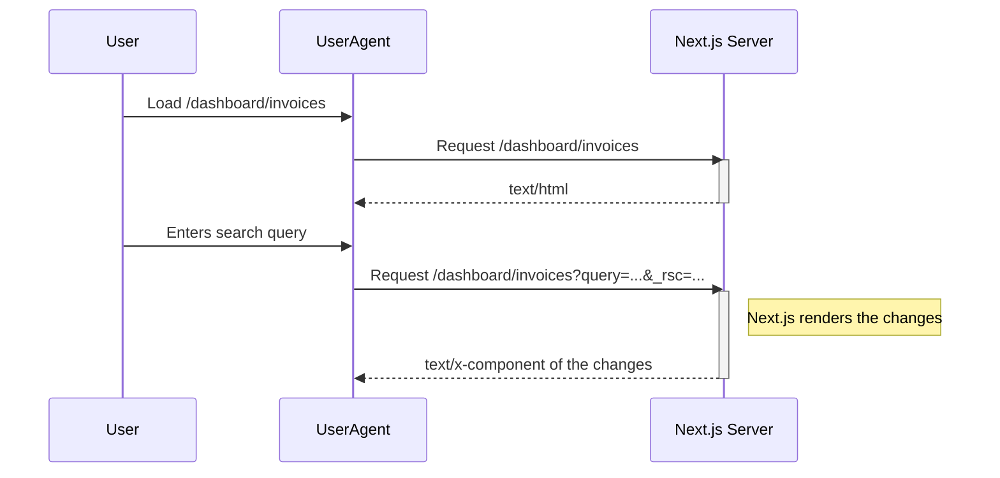

I was reading the [Next.js App Router course](https://nextjs.org/learn/dashboard-app), mostly for my own front end curiosity but also because I was looking at doing some frontend projects, as one does when you are frontend curious but mostly do backend development. When I got to [Chapter 11: Adding Search and Pagination](https://nextjs.org/learn/dashboard-app/adding-search-and-pagination), I was having a hard time really understanding what was happening and how Next was rendering the updates to the page. 

First let's start with what this part of the Next.js tutorial is about and how it explains it.

You start with a fairly static page.
```tsx
import Pagination from '@/app/ui/invoices/pagination';
import Search from '@/app/ui/search';
import Table from '@/app/ui/invoices/table';
import { CreateInvoice } from '@/app/ui/invoices/buttons';
import { lusitana } from '@/app/ui/fonts';
import { InvoicesTableSkeleton } from '@/app/ui/skeletons';
import { Suspense } from 'react';
 
export default async function Page() {
  return (
    <div className="w-full">
      <div className="flex w-full items-center justify-between">
        <h1 className={`${lusitana.className} text-2xl`}>Invoices</h1>
      </div>
      <div className="mt-4 flex items-center justify-between gap-2 md:mt-8">
        <Search placeholder="Search invoices..." />
        <CreateInvoice />
      </div>
      {/*  <Suspense key={query + currentPage} fallback={<InvoicesTableSkeleton />}>
        <Table query={query} currentPage={currentPage} />
      </Suspense> */}
      <div className="mt-5 flex w-full justify-center">
        {/* <Pagination totalPages={totalPages} /> */}
      </div>
    </div>
  );
}
```

The 2 main components we care about are the `<Search>` and `<Table>` components.
The `<Search>` component is the input that will take a query and somehow update the results in the `<Table>`. The tutorial explains that the best way to handle this is through using the page's url query params with `useSearchParams`.

The `Search` component then looks like this:
```tsx
'use client';
 
import { MagnifyingGlassIcon } from '@heroicons/react/24/outline';
import { useSearchParams, usePathname, useRouter } from 'next/navigation';
 
export default function Search() {
  const searchParams = useSearchParams();
  const pathname = usePathname();
  const { replace } = useRouter();
 
  function handleSearch(term: string) {
    const params = new URLSearchParams(searchParams);
    if (term) {
      params.set('query', term);
    } else {
      params.delete('query');
    }
    replace(`${pathname}?${params.toString()}`);
  }
//...
}
```

Note that part of the component was elided. See the full component in the [Git repo](https://github.com/jonfk/nextjs-14-server-components-updates-post/blob/main/app/ui/search.tsx).

Next, we need to wire the query params that were updated by our `Search` component into the `<Table>` component.

The page will now look like this:
```tsx
import Pagination from '@/app/ui/invoices/pagination';
import Search from '@/app/ui/search';
import Table from '@/app/ui/invoices/table';
import { CreateInvoice } from '@/app/ui/invoices/buttons';
import { lusitana } from '@/app/ui/fonts';
import { Suspense } from 'react';
import { InvoicesTableSkeleton } from '@/app/ui/skeletons';
 
export default async function Page({
  searchParams,
}: {
  searchParams?: {
    query?: string;
    page?: string;
  };
}) {
  const query = searchParams?.query || '';
  const currentPage = Number(searchParams?.page) || 1;
 
  return (
    <div className="w-full">
      <div className="flex w-full items-center justify-between">
        <h1 className={`${lusitana.className} text-2xl`}>Invoices</h1>
      </div>
      <div className="mt-4 flex items-center justify-between gap-2 md:mt-8">
        <Search placeholder="Search invoices..." />
        <CreateInvoice />
      </div>
      <Suspense key={query + currentPage} fallback={<InvoicesTableSkeleton />}>
        <Table query={query} currentPage={currentPage} />
      </Suspense>
      <div className="mt-5 flex w-full justify-center">
        {/* <Pagination totalPages={totalPages} /> */}
      </div>
    </div>
  );
}
```

Now, whenever the `<Search>` component updates the query params with the search query entered, the `<Table>` will have the search query passed into it's props so that it can show the right results.

Finally, let's take a look at what's happening in the `<Table>` component. 
```tsx
// ...
export default async function InvoicesTable({
  query,
  currentPage,
}: {
  query: string;
  currentPage: number;
}) {
  const invoices = await fetchFilteredInvoices(query, currentPage);
  // ...
}
```

This shows that the `<Table>` component calls an async function `fetchFilteredInvoices` with the query and currentPage obtained from the Props of the component. This async function could actually fetch the invoices from any data source. In the Next.js tutorial, it's from a database covered in a previous chapter. 

The tutorial for this chapter actually continues and covers a few more things: input debouncing (which which delays triggering any change until what is triggering the change stops, in this case it's the user typing) and pagination. But for our purposes, we can stop here and summarize what we and the tutorial covers and see we can understand what happened.

# Quick Summary

Our page has 2 components, a `<Search>` and a `<Table>` component. These 2 components interact with each other through the url query parameters of the page. 

The `<Search>` component takes user input of the search query and updates the query parameter of the page with that search query. e.g. the user enters `Lee` the url changes to `/dashboard/invoices?query=Lee`.

The `<Table>` component takes the query parameters as it's Props and renders the right data.

When the user types a new query into the search box, the `<Table>` component updates the data.

But how is this all happening? 
Does the page refresh when the query parameters are updated?
How does the table receive the updated data based on the search terms?

Maybe I am particularly thick or I might have missed something while reading this tutorial sleepy right before bed. But I had all these questions popping up in my head while reading this Chapter. 

[Chapter 9: Streaming](https://nextjs.org/learn/dashboard-app/streaming) does discuss how you can chunks of a page by loading partial content initially and then streaming in the rest of the content is chunks. This uses React `<Suspense>` feature or the Next.js `loading.tsx` feature. Maybe Next.js is streaming in the data to the component? 

[Chapter 10: Partial Prerendering](https://nextjs.org/learn/dashboard-app/partial-prerendering) covers how a page can be both static and dynamic. It describes the feature at a high level but I am not entirely sure if this is related to what I am missing.

# Let's see how it works

I have often found that the best way to understand how something works is to build and poke at what you want to understand. In this case, since this is a web thing, we can easily poke at it using dev tools. So let's do it.

We can reuse most of the code from the tutorial, except for the `fetchFilteredInvoices` function which uses a database and was setup in [Chapter 6 and 7](https://nextjs.org/learn/dashboard-app/setting-up-your-database). Instead we will mock this and use the data provided in the tutorial to populate the database. 

```typescript
import { customers, invoices } from '@/app/lib/placeholder-data';

const FETCH_SIMULATED_DELAY = 3000; // delay in milliseconds

export async function fetchFilteredInvoices(query: string, currentPage: number): Promise<{
  name: string | undefined,
  email: string | undefined,
  image_url: string | undefined,
  customer_id: string,
  amount: number,
  status: string,
  date: string
}[]> {
  return new Promise((resolve) => {
    setTimeout(() => {
      // Combine invoices with customer details
      const detailedInvoices = invoices.map(invoice => {
        const customer = customers.find(c => c.id === invoice.customer_id);
        return {
          ...invoice,
          name: customer?.name,
          email: customer?.email,
          image_url: customer?.image_url,
        };
      });

      // Simulate filtering based on the query
      const filteredInvoices = detailedInvoices.filter(invoice =>
        invoice.name?.toLowerCase().includes(query.toLowerCase())
      );

      // Simulate pagination
      const pageSize = 10;
      const startIndex = (currentPage - 1) * pageSize;
      const paginatedInvoices = filteredInvoices.slice(startIndex, startIndex + pageSize);

      resolve(paginatedInvoices);
    }, FETCH_SIMULATED_DELAY); // Simulate an x second delay
  });
}
```

For good measure, I also added a delay to the `fetchFilteredInvoices` function to simulate calling an external data source.

Let's run this example and see what's happening.

```bash
> npm run dev
```

![first_page_load] Insert screenshot here

On first page load everything is as expected. The initial request is a call to `/dashboard/invoices` which gets an html response. This initial request is followed by several various js requests to load the script to bootstrap the client side application. 

But what happens when we enter a search query?

![search_query_partial_render] Insert screenshot

We can see that the application does 2 requests. We can finally see what they are doing by inspecting them. What we see are that the requests on `/dashboard/invoices` with specific headers and query parameters, return a react tree response. This react tree is the part of the page that were updated. The first request is the initial render of the Skeleton Table in the `<Suspense>` tags while the `fetchFilteredInvoices` loaded the data to be rendered. The second request is then the `<Table>` component rendered with the loaded data.
```javascript
// 1. First Request
await fetch("http://localhost:3000/dashboard/invoices?query=Lee&_rsc=14zw6", {
    "credentials": "include",
    "headers": {
        "User-Agent": "Mozilla/5.0 (Windows NT 10.0; Win64; x64; rv:126.0) Gecko/20100101 Firefox/126.0",
        "Accept": "*/*",
        "Accept-Language": "en-US,en;q=0.5",
        "RSC": "1",
        "Next-Router-State-Tree": "%5B%22%22%2C%7B%22children%22%3A%5B%22dashboard%22%2C%7B%22children%22%3A%5B%22invoices%22%2C%7B%22children%22%3A%5B%22__PAGE__%22%2C%7B%7D%5D%7D%5D%7D%5D%7D%2Cnull%2Cnull%2Ctrue%5D",
        "Next-Router-Prefetch": "1",
        "Next-Url": "/dashboard/invoices",
        "Sec-Fetch-Dest": "empty",
        "Sec-Fetch-Mode": "cors",
        "Sec-Fetch-Site": "same-origin",
        "Priority": "u=4"
    },
    "referrer": "http://localhost:3000/dashboard/invoices",
    "method": "GET",
    "mode": "cors"
});

// 2. Second Request
await fetch("http://localhost:3000/dashboard/invoices?query=Lee&_rsc=181do", {
    "credentials": "include",
    "headers": {
        "User-Agent": "Mozilla/5.0 (Windows NT 10.0; Win64; x64; rv:126.0) Gecko/20100101 Firefox/126.0",
        "Accept": "*/*",
        "Accept-Language": "en-US,en;q=0.5",
        "RSC": "1",
        "Next-Router-State-Tree": "%5B%22%22%2C%7B%22children%22%3A%5B%22dashboard%22%2C%7B%22children%22%3A%5B%22invoices%22%2C%7B%22children%22%3A%5B%22__PAGE__%3F%7B%5C%22query%5C%22%3A%5C%22Lee%5C%22%7D%22%2C%7B%7D%2Cnull%2C%22refetch%22%5D%7D%5D%7D%5D%7D%5D",
        "Next-Url": "/dashboard/invoices",
        "Sec-Fetch-Dest": "empty",
        "Sec-Fetch-Mode": "cors",
        "Sec-Fetch-Site": "same-origin",
        "Priority": "u=4"
    },
    "referrer": "http://localhost:3000/dashboard/invoices",
    "method": "GET",
    "mode": "cors"
});
```

```
0:["development",[["children","dashboard","children","invoices","children","__PAGE__?{\"query\":\"Lee\"}",["__PAGE__?{\"query\":\"Lee\"}",{}],null,null]]]
```

```
0:["development",[["children","dashboard","children","invoices","children","__PAGE__?{\"query\":\"Lee\"}",["__PAGE__?{\"query\":\"Lee\"}",{}],"$L1",[null,"$L2"]]]]
1:["$L3","$L4",null]
2:[["$","meta","0",{"name":"viewport","content":"width=device-width, initial-scale=1"}],["$","meta","1",{"charSet":"utf-8"}],["$","meta","2",{"name":"next-size-adjust"}]]
5:I["(app-pages-browser)/./app/ui/search.tsx",["app/dashboard/invoices/page","static/chunks/app/dashboard/invoices/page.js"],""]
6:"$Sreact.suspense"
4:["$","div",null,{"className":"w-full","children":[["$","div",null,{"className":"flex w-full items-center justify-between","children":["$","h1",null,{"className":"__className_712214 text-2xl","children":"Invoices"}]}],["$","div",null,{"className":"mt-4 flex items-center justify-between gap-2 md:mt-8","children":["$","$L5",null,{"placeholder":"Search invoices..."}]}],["$","$6","Lee1",{"fallback":["$","div",null,{"className":"mt-6 flow-root","children":["$","div",null,{"className":"inline-block min-w-full align-middle","children":["$","div",null,{"className":"rounded-lg bg-gray-50 p-2 md:pt-0","children":[["$","div",null,{"className":"md:hidden","children":[["$","div",null,{"className":"mb-2 w-full rounded-md bg-white p-4","children":[["$","div",null,{"className":"flex items-center justify-between border-b border-gray-100 pb-8","children":[["$","div",null,{"className":"flex items-
...
```

# Summary

So we were able to answer some of the questions we had initially. Next.js manages the request lifecycle of the application. It does a full page load initially where it is necessary, but once loaded, replaces only parts of the page that are necessary. No full page reload happens when the query params are updated on the page or when new data is rendered to the page. The data is passed through the page's url query parameters mediated through `next/navigation` which manages the updates to the page when necessary.



Check out the repo where I tried to create a minimal example of what I looked into here.
[Github link](https://github.com/jonfk/nextjs-14-server-components-updates-post)
