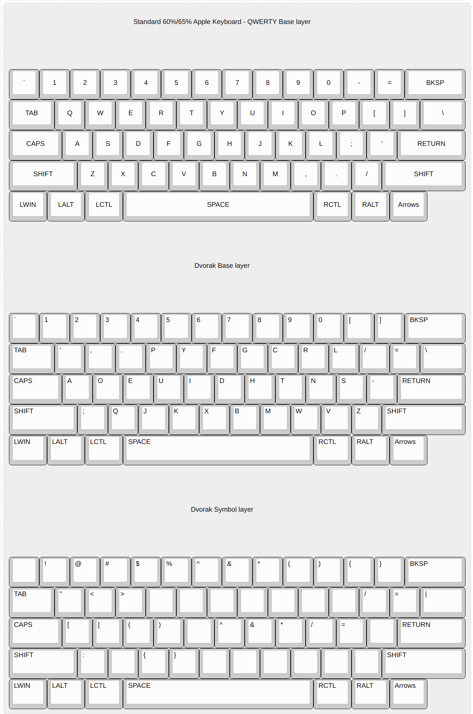

# Background

I am a dvorak keyboard user. I learned to touch type fairly late in life, in university at the age of 18 or so. Before
then, I had my own idiosyncratic way of touch typing with 2 or 3 fingers and glancing to the keyboard for certain keys.
To improve my typing accuracy and speed while doing my CS degree, I tried to learn it on qwerty but had a hard time 
because I already had habits that were hard to break. To break those habits and learn from a clean slate, I ended up
learning dvorak.

Aside: Dvorak was the popular alternative keyboard layout at the time, while there is much more in this space now, I
think dvorak is a decent choice since I noticed a lot of support from various software at all levels of the stack
from games to OSes. But the level of support might not really be necessary now with custom keyboards.

# QMK & Co

I tried the Planck not that long ago. The ortholinear layout promised vast improvements for homerowing because all
the keys are parallel, it's easier to move around. At least that was the promise. I found it hard to get used to,
but still persevered. What stopped me was the wrist pain I started getting. I am not sure if it was the ortholinear or
the higher profile, but in the end I had to abandon it. 

What really got me on it though was the QMK software, which allows you to customize the keyboard at the firmware level.
That was pretty incredible because you now don't need to have OS or software support. All the customization you would 
want can be done on the keyboard itself. There are so many options for customizations, I would recommend to take a look
for yourself if that interests you. A few in particular I found useful were the extra layers, home row mods, and tap dancing.

# Layers

By default, keyboards are actually already layered. If you squint, the shift key is a layer trigger where each key now
has another character it can type. So layers are essentially a way to get extra keys under certain circumstances, the
simplest one being when a key is pressed and held such as with shift.

# My customizations

I currently type on a regular apple magic keyboard. I like it a lot mainly because it's so similar to the Macbook Pro
keyboard which I am often using. I find the typing experience pretty comfortable.

Because it's a regular keyboard, I don't have many options for layer keys. But because of a few of my own idiosyncracies,
I don't use the mod keys to the right of the spacebar much. So I am now experimenting with using the key to the right
of the spacebar as my symbol layer trigger. 

The idea of the symbol layer is to map some of the special characters that I find hard to type for some reason.
I can't exactly explain why but moving my right pinky and ring finger is hard and I often mistype those symbols. In 
addition to that, I find that moving my right hand to reach the number row is slower and I often have a hard time 
settling my fingers back to the homerow.

So to help with that I decided to remap the special characters that are on the right side of the keyboard while keeping
the characters that I am currently content with. I decided to add a small ux improvement that the symbol trigger also
acts as the shift for certain keys so that I can more easily access them. The reason for those is because I often favor
the left shift and therefore end up typing those left side symbols with one hand instead of 2 as would be the recommended
way.

Without much further ado, here are the layouts.



<details>
	<summary>If you prefer plain text</summary>

```
# Standard 60%/65% Apple Keyboard 

## QWERTY Base layer

┌─────┬───┬───┬───┬───┬───┬───┬───┬───┬───┬───┬───┬───┬───────┐
│ `   │ 1 │ 2 │ 3 │ 4 │ 5 │ 6 │ 7 │ 8 │ 9 │ 0 │ - │ = │ BKSP  │
├─────┴─┬─┴─┬─┴─┬─┴─┬─┴─┬─┴─┬─┴─┬─┴─┬─┴─┬─┴─┬─┴─┬─┴─┬─┴─┬─────┤
│ TAB   │ Q │ W │ E │ R │ T │ Y │ U │ I │ O │ P │ [ │ ] │  \  │
├───────┴┬──┴┬──┴┬──┴┬──┴┬──┴┬──┴┬──┴┬──┴┬──┴┬──┴┬──┴┬──┴─────┤
│ CAPS   │ A │ S │ D │ F │ G │ H │ J │ K │ L │ ; │ ' │ RETURN │
├────────┴─┬─┴─┬─┴─┬─┴─┬─┴─┬─┴─┬─┴─┬─┴─┬─┴─┬─┴─┬─┴─┬─┴────────┤
│ SHIFT    │ Z │ X │ C │ V │ B │ N │ M │ , │ . │ / │  SHIFT   │
├──────┬───┴┬──┴──┬┴───┴───┴───┴───┴───┴──┬┴───┴┬──┴─┬────────┤
│ LWIN │LALT│ LCTL│          SPACE        │ RCTL│RALT│ Arrows │
└──────┴────┴─────┴───────────────────────┴─────┴────┴────────┘

## Dvorak Base layer

┌─────┬───┬───┬───┬───┬───┬───┬───┬───┬───┬───┬───┬───┬───────┐
│ `   │ 1 │ 2 │ 3 │ 4 │ 5 │ 6 │ 7 │ 8 │ 9 │ 0 │ [ │ ] │ BKSP  │
├─────┴─┬─┴─┬─┴─┬─┴─┬─┴─┬─┴─┬─┴─┬─┴─┬─┴─┬─┴─┬─┴─┬─┴─┬─┴─┬─────┤
│ TAB   │ ' │ , │ . │ P │ Y │ F │ G │ C │ R │ L │ / │ = │  \  │
├───────┴┬──┴┬──┴┬──┴┬──┴┬──┴┬──┴┬──┴┬──┴┬──┴┬──┴┬──┴┬──┴─────┤
│ CAPS   │ A │ O │ E │ U │ I │ D │ H │ T │ N │ S │ - │ RETURN │
├────────┴─┬─┴─┬─┴─┬─┴─┬─┴─┬─┴─┬─┴─┬─┴─┬─┴─┬─┴─┬─┴─┬─┴────────┤
│ SHIFT    │ ; │ Q │ J │ K │ X │ B │ M │ W │ V │ Z │  SHIFT   │
├──────┬───┴┬──┴──┬┴───┴───┴───┴───┴───┴──┬┴───┴┬──┴─┬────────┤
│ LWIN │LALT│ LCTL│          SPACE        │ RCTL│RALT│ Arrows │
└──────┴────┴─────┴───────────────────────┴─────┴────┴────────┘

## Dvorak Symbol layer

┌─────┬───┬───┬───┬───┬───┬───┬───┬───┬───┬───┬───┬───┬───────┐
│     │ ! │ @ │ # │ $ │ % │ ^ │ & │ * │ ( │ ) │ { │ } │ BKSP  │
├─────┴─┬─┴─┬─┴─┬─┴─┬─┴─┬─┴─┬─┴─┬─┴─┬─┴─┬─┴─┬─┴─┬─┴─┬─┴─┬─────┤
│ TAB   │ " │ < │ > │   │   │   │   │   │   │   │ / │ = │  |  │
├───────┴┬──┴┬──┴┬──┴┬──┴┬──┴┬──┴┬──┴┬──┴┬──┴┬──┴┬──┴┬──┴─────┤
│ CAPS   │ [ │ ] │ ( │ ) │   │ ^ │ & │ * │ / │ = │   │ RETURN │
├────────┴─┬─┴─┬─┴─┬─┴─┬─┴─┬─┴─┬─┴─┬─┴─┬─┴─┬─┴─┬─┴─┬─┴────────┤
│ SHIFT    │ : │   │ { │ } │   │   │   │   │   │   │  SHIFT   │
├──────┬───┴┬──┴──┬┴───┴───┴───┴───┴───┴──┬┴───┴┬──┴─┬────────┤
│ LWIN │LALT│ LCTL│          SPACE        │ RCTL│RALT│ Arrows │
└──────┴────┴─────┴───────────────────────┴─────┴────┴────────┘
```
</details>

# Implementation

I am currently only implementing this on xremap for my linux desktop for now. If I find it useful, I will add it
to my karabiner config too.

One note is that because I am using the dvorak keyboard layout and then doing the remaping for the symbol layer on
xremap, the config is a bit weird. If you are interested in something similar, you would have to adapt it to your
specific setup. 

It might actually be simpler if I did the dvorak keyboard remapping directly in xremap. Not sure of what the side effects
of that would be, but something to experiment with possibly.

[xremap config](https://github.com/jonfk/dotfiles/tree/master/xremap)
